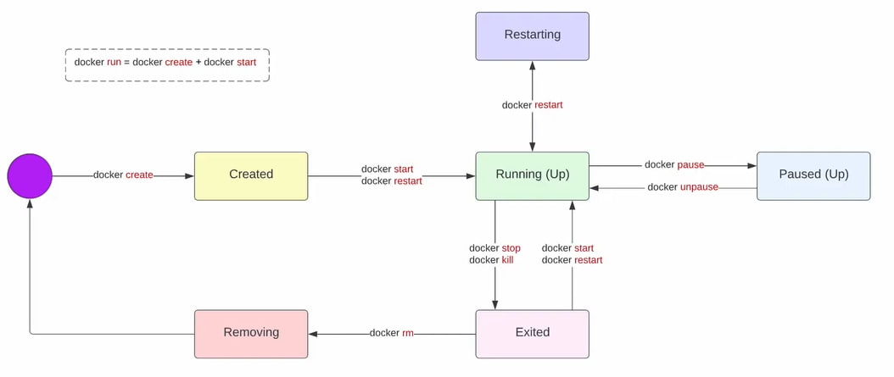

**Жизненный цикл Docker контейнера**

### Создание (Created):
- Контейнер создаётся с помощью команды `docker create`.  
- Команда `docker run` объединяет `docker create` и `docker start` [[2]].

### Запуск (Running):
- Контейнер начинает работать с командами `docker start` или `docker restart`.  
- Можно приостановить контейнер командой `docker pause` и возобновить работу командой `docker unpause` [[3]].

### Перезапуск (Restarting):
- Контейнер автоматически перезапускается командой `docker restart`.

### Пауза (Paused):
- Контейнер временно приостанавливается командой `docker pause` и возобновляется командой `docker unpause` [[2]].

### Остановка (Exited):
- Контейнер прекращает свою работу командами `docker stop` или `docker kill`.

### Удаление (Removing):
- Контейнер удаляется командой `docker rm`.